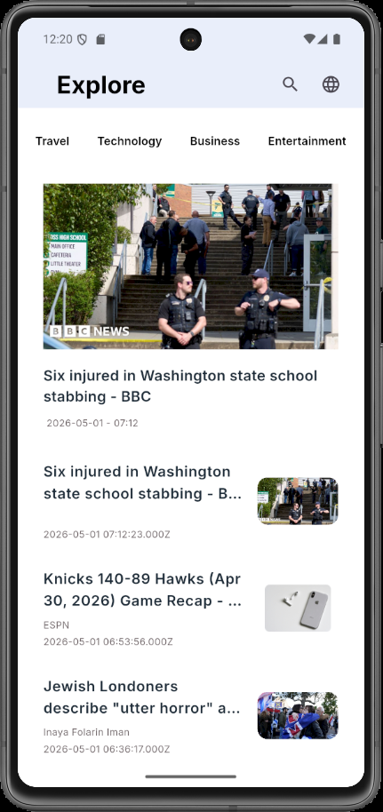
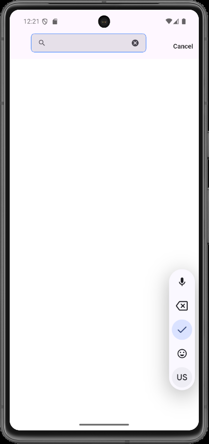
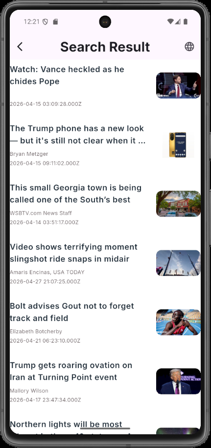

# News App 📰

A Flutter news application that displays the latest news headlines, categories, and search results using a clean and responsive user interface.

The app supports English and Arabic news results, with a simple search experience and modern mobile UI design.

---

## 📱 Screenshots

> Put your images inside a folder named `screenshots`.

| Home Screen | Search Screen |
|------------|---------------|
|  |  |

| Search Result - English | Search Result - Arabic |
|--------------------------|-------------------------|
|  |  |

---

## ✨ Features

- Display latest news headlines
- Browse news by categories
- Search for news articles
- Show English search results
- Show Arabic search results
- News cards with title, author, date, and image
- Clean and simple user interface
- Responsive mobile design
- Navigation between screens

---

## 🛠️ Technologies Used

- Flutter
- Dart
- REST API
- Dio / HTTP
- GoRouter
- Flutter ScreenUtil

---

## 📂 Project Structure

    lib/
    │
    ├── Core/
    │   ├── Styling/
    │   ├── app_routes.dart
    │
    ├── Features/
    │   ├── HomeScreen/
    │   │   ├── Models/
    │   │   ├── Services/
    │   │   ├── Widgets/
    │   │   └── HomeScreen.dart
    │   │
    │   ├── SearchScreen/
    │   │   ├── Widgets/
    │   │   └── SearchScreen.dart
    │   │
    │   ├── SearchResultScreen/
    │   │   ├── Model/
    │   │   ├── Services/
    │   │   └── SearchResultScreen.dart
    │
    └── main.dart

---

## 🚀 Getting Started

To run this project locally:

### 1. Clone the repository

    git clone https://github.com/kero12-eg/news_app.git

### 2. Open the project folder

    cd news_app

### 3. Install dependencies

    flutter pub get

### 4. Run the app

    flutter run

---

## 🔑 API

This app uses a News API to fetch articles and headlines.

Make sure to add your API key in the service file before running the app.

Example:

    const String apiKey = "YOUR_API_KEY";

---

## 📌 App Screens

### Home Screen

The home screen displays the latest news and news categories such as:

- Travel
- Technology
- Business
- Entertainment

### Search Screen

The search screen allows the user to type a keyword and search for news articles.

### Search Result Screen

The search result screen displays articles related to the searched keyword.

The app supports showing search results in:

- English
- Arabic

---

## 🖼️ Screenshots Files Names

Make sure the screenshots folder contains these images with the same names:

    screenshots/HomeScreen.png
    screenshots/SearchScreen.png
    screenshots/SearchResultScreenEN.png
    screenshots/SearchResultScreenAR.png

---

## 👨‍💻 Developer

Developed by **Kero Emad**

GitHub: [kero12-eg](https://github.com/kero12-eg)

---

## 📄 License

This project is for learning and portfolio purposes.
